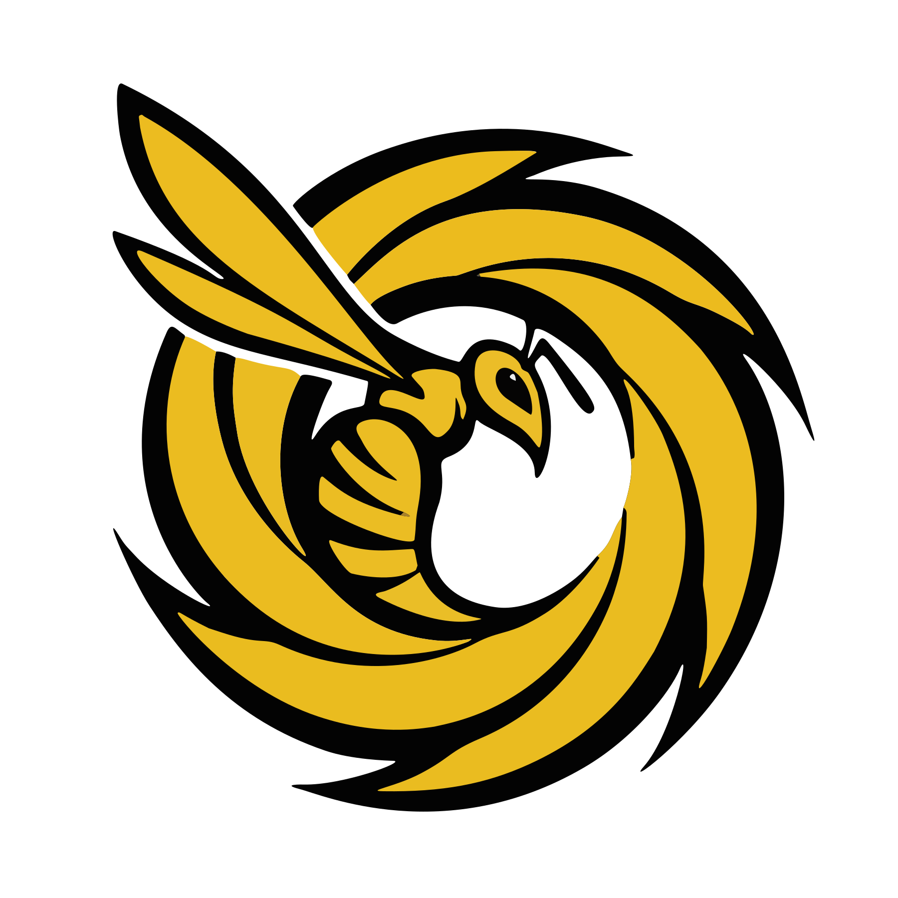

<div align="center">

<h1>Soifon</h1>


<p><b>Soifon</b> is a browser extension that monitors network traffic and browser storage for given URL rules, automatically capturing and recording regex-matched values from requests and browser storage.</p><br>

<a href="#features">Features</a>&nbsp;&bull;&nbsp;<a href="#installation">Installation</a>&nbsp;&bull;&nbsp;<a href="#usage">Usage</a>&nbsp;&bull;&nbsp;<a href="#security">Security</a>
</div>

---

## Features

- **Network Request Monitoring**: Automatically captures values from POST request bodies using regex patterns
- **Storage Extraction**: Extracts values from `localStorage`, `sessionStorage`, and cookies based on URL patterns
- **Rule-Based Configuration**: Define custom rules with URL patterns and capture patterns
- **Automatic Notifications**: Get notified when values are captured
- **Easy Access**: View and copy copied data directly from the extension popup
- **Dark Theme UI**: Clean, modern interface optimized for developer workflows
- **Data Retention**: Keeps the last 50 captured items

## Installation

1. Clone this repository:

```bash
git clone <repository-url>
cd soifon
```

2. Open Chrome/Chromium and navigate to `chrome://extensions/`

3. Enable "Developer mode" (toggle in the top right)

4. Click "Load unpacked" and select the `soifon` directory

5. The Soifon extension icon should now appear in your browser toolbar

## Usage

### Setting Up Network Rules

Network rules capture values from POST request bodies:

1. Click the Soifon extension icon
2. Navigate to the **Settings** tab
3. Under "Network Auto-Copy Rules":
   - **Rule Name**: A descriptive name for this rule (e.g., "AWS SAML")
   - **URL Regex (Trigger)**: Regex pattern to match URLs (e.g., `signin\.aws\.amazon\.com`)
   - **Body Regex (Capture Group 1)**: Regex pattern with a capture group to extract the value (e.g., `SAMLResponse=([^&]+)`)
4. Click "Add Network Rule"

### Setting Up Storage Rules

Storage rules extract values from browser storage:

1. In the **Settings** tab, under "Storage Extraction Rules":
   - **Rule Name**: A descriptive name for this rule (e.g., "Session Token")
   - **URL Regex (Trigger)**: Regex pattern to match URLs (e.g., `mywebsite\.com`)
   - **Key Name**: The storage key name to extract (e.g., `auth_token`)
2. Click "Add Storage Rule"

The extension will check:
- `localStorage`
- `sessionStorage`
- Cookies

### Viewing Captured Data

1. Click the Soifon extension icon
2. Navigate to the **Captured** tab
3. View all captured values with timestamps
4. Click "Copy" to copy a value to your clipboard
5. Use "Clear All" to remove all captured data

## Permissions

Soifon requires the following permissions:

- `webRequest`: Monitor network traffic
- `storage`: Store rules and captured data
- `cookies`: Read cookie values
- `scripting`: Extract values from page storage
- `tabs`: Access tab information
- `notifications`: Show capture notifications
- `<all_urls>`: Monitor requests across all websites

## Security

Soifon is designed for **developer and security workflows** such as capturing SAML assertions, session tokens, and API keys for debugging and testing purposes.

- All captured data is stored **locally** in Chrome's extension storage and is never transmitted externally
- The extension requires broad permissions (`<all_urls>`, `tabs`, `webRequest`) to monitor arbitrary URLs based on user-defined rules -- these permissions are necessary for core functionality
- Review your configured rules carefully, as the extension will capture and store any values that match your regex patterns
- Clear captured data regularly, especially when working with sensitive credentials
